# Kairos Fest Management System

# 📑 Index 

- [ABSTRACT](#abstract)
- [INTRODUCTION](#introduction)
- [SYSTEM ANALYSIS](#system-analysis)
- [ER DIAGRAM](#er-diagram)
- [TESTING](#testing)
- [CONCLUSION](#conclusion)
- [OUTPUTS](#outputs)
- [App Configuration](#app-configuration)
- [PROJECT EXECUTION AND SNAPSHOTS](#project-execution-and-snapshots)

---
---

## ABSTRACT
Kairos’25 is an innovative website developed entirely by students, for the successful
management and execution of the annual fest organized by the Department of
Computer Science. The primary objective of this platform is to provide a centralized,
user-friendly interface that allows participants, event coordinators, and faculty
members to effortlessly track various events, their schedules, venues, and results.
The website is designed to create a fun, engaging, and creative environment that
enhances the overall fest experience. With a focus on usability and accessibility, it
ensures that participants are well-informed about their events and can navigate
through the fest with ease and enjoyment. The system also simplifies coordination for
faculty and student organizers, offering a streamlined approach to event management.
Built using modern web technologies such as React, TypeScript, JavaScript, and
Node.js, the website showcases the technical capabilities and collaborative effort of
the students involved. Furthermore, it leverages robust cloud infrastructure, utilizing
services from Amazon Web Services (AWS), including features like S3 Buckets for
storage, CDN for efficient content delivery, and server-side integrations to ensure
scalability and performance.
By combining technical innovation with event management needs, the Kairos’25
website stands as a testament to student creativity, technical expertise, and teamwork,
making the fest both memorable and efficiently organized.


---
---

## INTRODUCTION

Every college fest is a vibrant mosaic of culture, creativity, and celebration. It is an
occasion that not only showcases talent but also fosters a deep sense of community,
belonging, and shared achievement among students, faculty, and visitors. However,
behind the dazzling performances, bustling crowds, and colorful decorations lies an
immense amount of work—meticulous planning, tireless coordination, and a seamless
integration of logistics and communication. Managing such a large-scale event is no
easy feat. In today’s fast-paced digital world, the traditional methods of handling fest
operations are no longer sufficient. The need for precision, speed, and scalability has
become more important than ever. This realization gave rise to Kairos’25—a next-
generation digital platform conceptualized and developed entirely by the students of
the Department of Computer Science, aimed at transforming how cultural fests are
organized, monitored, and experienced.
Kairos’25 is not just a technical project—it is the manifestation of student-driven
innovation, passion, and purpose. The platform was born from a shared desire to
overcome the chaos that often accompanies event planning and to replace it with a
structured, tech-enabled solution that enhances productivity, communication, and
overall fest experience. It stands as a testament to what students can achieve when
provided with the autonomy and encouragement to tackle real-world problems using
the tools of modern technology.
The name "Kairos", derived from the ancient Greek word meaning "the right or
opportune moment," perfectly captures the essence and timing of this initiative. It
symbolizes a moment seized—a gap recognized and bridged with determination and
technical ingenuity. Kairos’25 arrived at just the right time, aligning with both the
growing scale of the college fest and the increasing digital fluency of its participants
and organizers.
From its very inception, the development of Kairos’25 was grounded in real user
needs. Students brainstormed features not in isolation, but through deep engagement
with event coordinators, participants, faculty members, and volunteers. This ensured
that the final product was not only technically sound but also human-centered and
inclusive.
Technically, Kairos’25 was built using a powerful and modern tech stack: React for
dynamic and responsive frontend experiences, TypeScript and JavaScript for robust
application logic, and Node.js for scalable server-side functionality. The platform is
hosted on Amazon Web Services (AWS), taking advantage of tools such as S3
Buckets for secure and efficient data storage, CloudFront CDN for fast global content
delivery, and auto-scaling server instances that handle varying levels of user traffic
without performance degradation. Each of these choices was made not out of trend-
following, but with a clear focus on performance, security, scalability, and long-term
reliability.
2What truly distinguishes Kairos’25 is its emphasis on user experience. Whether you're
a first-time fest participant trying to locate your event venue, a student volunteer
managing on-the-ground tasks, or a faculty advisor overseeing the schedule, the
platform is tailored to simplify your journey. The interface is clean and visually
engaging, designed with intuitive navigation and real-time functionality, including
live notifications, event tracking, and progress dashboards. The user interface was
built in accordance with modern UI/UX principles, placing special importance on
accessibility, responsiveness, and clarity to ensure an inclusive and smooth experience
across devices.
Beyond its functional benefits, Kairos’25 also became an opportunity for the student
developers to engage in collaborative learning and practical application of their
academic knowledge. It was a real-world project where they had to manage timelines,
resolve bugs, handle version control, test across environments, and deploy under
pressure—skills that textbooks can only introduce but projects can truly develop. The
team practiced agile development, engaged in continuous feedback cycles, and
conducted usability testing to polish the platform into what it is today.
In essence, Kairos’25 evolved into something far greater than what it was initially
intended to be. It became a platform not just for fest management, but for student
empowerment. It exemplifies what young minds can build when they are encouraged
to innovate, trusted with responsibility, and supported in their vision. It represents a
fusion of learning and leadership, of code and creativity.
This report chronicles the complete journey of Kairos’25—from early ideation to final
deployment and its live performance during the fest. It details the thought processes,
technologies, design philosophies, and challenges encountered along the way. More
importantly, it encapsulates a story of teamwork, growth, and the powerful impact of
student-led initiatives in shaping better academic and cultural ecosystems.

---
---

## SYSTEM ANALYSIS
This document presents a system analysis for the **Kairos Project**. It identifies problems in the current event management process, outlines objectives, evaluates feasibility, and describes technical and functional requirements to improve event execution.

---

### 1. Problem Definition

**Current Challenges:**

* Reliance on offline methods like posters, manual registration, and paper-based result tracking.
* Issues include:

  * Miscommunication
  * Delays in updates and announcements
  * Time-consuming, error-prone registration
  * Limited information reach
* Consequences:

  * Missed updates
  * Overwhelmed organizers
  * Increased delays and operational hassle

---

### 2. Objectives

* Provide a centralized web-based platform
* Enable online registration with confirmation
* Deliver real-time updates, schedules, and results
* Offer a user-friendly interface for better engagement
* Reduce organizers' workload
* Allow online participation
* Include an online photo gallery for memories

---

### 3. Existing System

* **Communication:** Posters and word-of-mouth only
* **Registrations:** Paper-based with high risk of data loss
* **No online updates:** No real-time information sharing
* **Human error & delays:** Manual systems are inefficient
* **Inaccurate calculations:** Manual scorekeeping prone to error
* **Time-consuming:** Physical registration required
* **Error-prone:** Miscommunication and data mishandling

---

### 4. Proposed System

* **Responsive Web Application:** Accessible via desktop and mobile
* **Digital Registration Forms:** Instant confirmation via email/SMS
* **Live Event Updates:** Real-time schedules, announcements, and results
* **Admin Panel (Optional):** Manage events, participants, and updates
* **Tech Stack:**

  * React.js, Node.js, Express.js, TypeScript
  * Google Auth, Razorpay (optional), AWS, GitHub

---

### 5. Feasibility Study

#### a. Technical Feasibility

* **Tech Stack:** React.js, Node.js, Express.js
* **Compatibility:** Responsive across devices
* **Cloud Hosting:** AWS for scalable infrastructure
* **Security:** Google Auth & secure practices
* **Scalability:** Designed to support high user loads

#### b. Operational Feasibility

* **Ease of Use:** Simple UI for participants and admins
* **User Acceptance:** Expected to be well received
* **Support:** Regular maintenance and feature updates

#### c. Economic Feasibility

* **Low Cost Development:** Open-source tools
* **Affordable Hosting:** AWS and domain fees
* **ROI:** Increased participation and sponsorship

---

### 6. System Requirements

#### a. Hardware Requirements

* **Devices:** PC, Laptop, Smartphone, Tablet (with internet)
* **Connectivity:** Stable internet connection (Wi-Fi/Broadband)

#### b. Software Requirements

* **Browsers:** Chrome, Firefox, Safari, Edge (latest versions)
* **Internet:** Required for live features and navigation

#### c. Backend Requirements

* **Server:** Node.js & Express.js
* **Hosting:** AWS + Cloudflare for CDN & security
* **Payments:** Razorpay/Stripe (optional)
* **Database:** MongoDB

---

### 7. Modules

#### a. Home Page

* Welcome banner, countdown timer, featured events

#### b. Event Listing

* Event categories, details, rules, eligibility

#### c. Registration Module

* Online forms, confirmations, optional payment integration

#### d. Announcements & Results

* Real-time updates, results, and reminders

#### e. Admin Module (Optional)

* Manage events, participants, schedules, and announcements

#### f. Special Event Pages

* Dedicated sections for IT Manager, Quiz, Coding, etc.

#### g. Event Gallery

* Digital photo album of fest moments

#### h. Benefits

* Streamlined event execution
* Reduced paperwork and errors
* Improved communication and UX
* Better visibility and branding
* Efficient coordination and resource tracking

#### i. Constraints

* Internet dependence
* Backend reliability and maintenance
* Initial training for admins and volunteers

---

### 8. SDLC Model Used: Iterative Model

The **Iterative Model** was chosen for its adaptability. Each development cycle included requirement gathering, design, implementation, testing, and evaluation, improving the system with each iteration.

#### Phases:

1. **Requirement Analysis**

   * Feedback-driven updates post every iteration

2. **System Design**

   * Wireframes, layout planning, DB schemas

3. **Implementation**

   * Developed using React, Node.js, Express, TypeScript

4. **Testing**

   * Unit, integration, and user acceptance testing

5. **Evaluation & Feedback**

   * Reviewed by stakeholders

6. **Deployment**

   * Final version deployed on AWS/Netlify

7. **Maintenance**

   * Regular updates, bug fixes, performance tuning

#### Why Iterative Was Ideal

* Responsive to evolving requirements
* Supported real-time stakeholder feedback
* Delivered a polished and flexible product

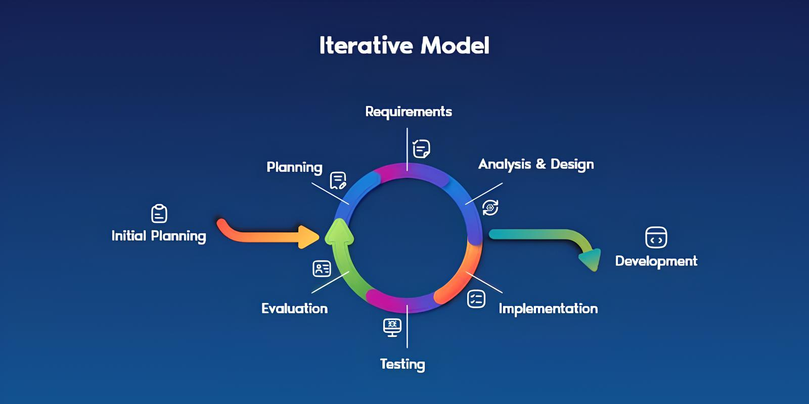

#### Explanation of Each Stage:

1. **Start:** Defined goals like user engagement
2. **Requirement Analysis:** Competitor analysis and Home Page design
3. **System Design:** Gradual evolution through wireframes and layout drafts
4. **Implementation:** Frontend/backend development
5. **Testing:** Manual and automated tests
6. **Evaluation & Feedback:** Iteration-based improvements

---
---

<!-- System Design -->
## SYSTEM DESIGN

### Design Objectives

The design of the Kairos website was guided by modern web development trends and best practices to ensure a smooth, responsive, and engaging user experience. Our goal was to build a platform that not only looked appealing but also functioned efficiently across various devices and browsers.

We adopted scalable and modular architecture patterns to support future enhancements and minimize maintenance complexity. Special attention was given to performance optimization — techniques such as browser-side caching and server-side content delivery were implemented to reduce server load and improve page load times.

In addition, the system was designed to be mobile-friendly, ensuring accessibility on smartphones, tablets, and desktops. User experience (UX) principles were followed to maintain intuitive navigation and layout consistency across all pages.

Security and reliability were also considered during the design phase. We ensured secure data handling, particularly for registration and payment processes, while maintaining fast response times even during peak usage.

### Architecture Overview

The Kairos project follows a modular, component-based architecture leveraging a modern web stack to deliver a scalable, maintainable, and responsive application. The architecture is designed to separate concerns across the frontend and backend, ensuring performance, reliability, and security.

#### Frontend Architecture

* **Framework:** React.js with TypeScript for type safety and component modularity.
* **UI Design:** Responsive design using modern CSS libraries and media queries.
* **Routing:** React Router for single-page application (SPA) navigation.
* **State Management:** Context API or lightweight custom state handling
* **Optimizations:** Lazy loading, code splitting, browser caching.

#### Backend Architecture (Optional / When Needed)

* **Runtime:** Node.js with Express.js for building RESTful APIs.
* **Authentication:** Google Auth integration for secure login.
* **Payments:** Razorpay for handling online transactions.
* **Cloud Hosting:** Deployed on AWS EC2 with scalability via Docker & Kubernetes.
* **Security:** HTTPS, input sanitization, CORS configuration.

#### Additional Integrations

* **GitHub:** For version control and team collaboration.
* **Cloudflare:** For DNS and CDN services to improve performance and protection.
* **Data Handling (if implemented):** MongoDB / Firebase / AWS RDS for persistent storage.

#### DevOps and Deployment

* **CI/CD Pipelines:** GitHub Actions for testing and automated deployment.
* **Containerization:** Docker is used for consistent environment setup.
* **Scalability:** Kubernetes (K8s) for orchestration and service reliability.

### System Architecture Diagram


#### Block-wise System Architecture Diagram


#### AWS Architecture Diagram

1. **Elastic IP:** Static public IPv4 address for consistent access.
2. **VPC:** Secure virtual network hosting AWS resources.
3. **Autoscale:** Dynamically adjusts EC2 instances.
4. **EC2 instance:** Hosts application components.
5. **Ingress:** Manages external access in Kubernetes.
6. **Kubernetes Services:** Stable communication endpoints within the cluster.
7. **Master Node:** Orchestrates the Kubernetes cluster.
8. **Pods:** Containers that run app components.

#### GitHub Architecture Diagram


**What are GitHub actions?**
GitHub Actions is a CI/CD platform for automating development workflows.

##### Workflow Stages

1. **On Push:** Triggers when code is pushed.
2. **GitHub Workflow:** Defines CI/CD pipeline steps.
3. **Software Tasks:** Runs build/tests.
4. **Updating Docker Files:** Builds and pushes Docker images.
5. **Updating Main Branch:** Merges verified code.
6. **Restarting the Server:** Redeploys Docker containers.
7. **Success:** Live deployment.
8. **Error Handling:** Cancels deployment on failure.

### Database Architecture Diagram


MongoDB with a replica set: one primary node (write ops) and three secondary nodes (read ops). Dev and Prod databases are maintained separately.

### Module-Wise Design

#### Landing Page

User-friendly index page highlighting features.

#### Dashboards

* **User Dashboard:** Registration, payments, photo uploads.
* **Coordinator Dashboard:** View and enter scores.
* **Faculty Dashboard:** Review and validate scores.
* **Admin Dashboard:** Full access to monitor the system.

#### Events Module

Users register/participate in events like:

* IT Manager
* IT Quiz
* Coding MCQ

#### Authentication Module

Google OAuth for secure login.

#### Photo Booth

Upload and share event memories.

### UI/UX Design

* **Wireframes:** Prototypes made with Figma.
* **Responsive Design:** Mobile to desktop support.
* **Color Scheme:** Consistent and branded.
* **Navigation:** Simple and accessible.
* **Feedback & Accessibility:** Visual cues, accessibility support.

### Database Design

#### Why MongoDB?

NoSQL flexibility for diverse data.

#### Role of Mongoose

Provides schema layer, validation, middleware, and methods.

#### Key Design Features

* **Schema Definitions:** User, Event, Score, Photo, etc.
* **Document-Oriented:** Nested documents for grouping.
* **References:** ObjectId linking.
* **Indexing:** Optimized queries.
* **Scalability:** Horizontal scaling.
* **Validation & Middleware:** Enforced via Mongoose.
* **Security:** Environment config, OAuth, permissions.
* **Backups:** Failover-ready.

### Security Measures

1. **Auth & Authorization:** Google OAuth, RBAC, token-based access.
2. **Backend Security:** Helmet, validation, sanitization, TypeScript.
3. **Database Security:** TLS, schema rules, access control.
4. **Infrastructure Security:** IAM roles, secure Docker images, K8s policies.
5. **Frontend Security:** CSP, safe prop handling.
6. **Secure Communication:** HTTPS/TLS everywhere.
7. **Secrets Management:** .env, Kubernetes Secrets, AWS Secrets Manager.
8. **Monitoring & Logging:** Centralized logs, alerts.

### Summary

This multi-layered design ensures a secure, scalable, and maintainable system across development, deployment, and production environments.

---
---

<!-- ER Diagram -->
## ER DIAGRAM

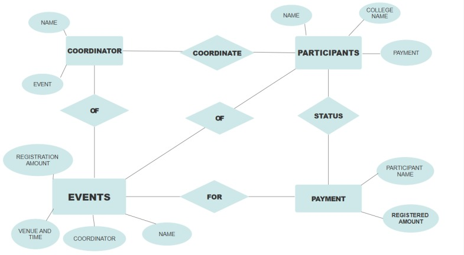
---
---

<!-- Testing -->
## TESTING

Thorough testing was an essential part of the development process to ensure the application functions correctly, is reliable, and meets the project requirements.

### 1. Unit Testing
- The backend logic, developed using Node.js and TypeScript, was rigorously tested using **Jest**, a powerful JavaScript testing framework.
- Unit tests were written for individual functions, controllers, and service layers to verify that each part of the backend behaves as expected in isolation.
- These tests included validation of business logic, database operations using Mongoose with MongoDB, and API response handling.
- By using Jest’s features such as mocking and assertion libraries, external dependencies like database calls were simulated, enabling focused testing of the backend logic without needing a live database connection for every test.
- TypeScript’s static typing provided an additional safety net by catching potential errors during compile time, reducing runtime bugs.

### 2. Integration Testing
- Integration tests were conducted to verify that different backend components work together seamlessly.
- These tests focused on the interaction between the API endpoints, authentication mechanisms (Google OAuth), and the MongoDB database.
- For example, the tests checked that user data was properly stored, retrieved, and updated in the database, and that authentication tokens were correctly validated.
- Integration tests also ensured that role-based access control was enforced, verifying that users with different roles (user, coordinator, admin) could only access authorized routes and resources.

### 3. Security Testing
- Special attention was given to security aspects by testing for vulnerabilities such as injection attacks.
- Inputs to the backend APIs were validated and sanitized to prevent NoSQL injection and other common attack vectors.
- Tests also confirmed that HTTP headers set by **Helmet** were correctly applied to mitigate risks like cross-site scripting (XSS), clickjacking, and MIME sniffing.
- Authentication workflows were tested to ensure that only authenticated users could access protected resources, and that authorization was strictly enforced.

### 4. Continuous Integration (CI) Testing
- Testing was integrated into the development workflow through **GitHub Actions**, which automated test execution on every push or pull request.
- This continuous integration approach ensured that all new code changes were automatically validated by the test suite, helping catch errors early and maintain high code quality.
- Automated testing pipelines increased development efficiency by providing immediate feedback to developers and preventing faulty code from being merged or deployed.

---

#### Conclusion

By focusing on unit and integration testing with Jest for the backend, complemented by automated testing in CI pipelines, the project achieved a reliable and well-tested codebase. This systematic testing approach improved code stability, reduced bugs, and ensured secure and smooth operation of core backend functionalities.

---
---

<!-- Conclusion -->
## CONCLUSION

As we draw the curtain on the development journey and deployment of **Kairos’25**, it becomes essential to reflect not only on the technical achievements but also on the spirit of innovation, teamwork, and resilience that powered this transformative initiative.

**Kairos’25** was never just a software project—it was a **movement**. A collective leap by students who dared to reimagine the traditional, manual, and often chaotic process of college fest management, and in doing so, redefined what it means to be student developers, event organizers, and changemakers.

---

### 🚀 Purpose and Vision

From the moment the idea was born, it was evident that this project would break conventional boundaries. It wasn’t just about creating a website—it was about building an **ecosystem**.

A dynamic digital hub where fest participants, organizers, and faculty could:
- Converge seamlessly
- Communicate effortlessly
- Celebrate wholeheartedly

---

### 🧠 Development Approach

The team embraced the **Iterative SDLC model**, enabling:
- Cycles of planning, implementation, testing, and evaluation
- Continuous adaptation to changing requirements
- Quick integration of real-time updates and improvements

---

### 🧑‍💻 User-Centered Design

Design decisions prioritized **empathy and inclusivity**:
- Real-time notifications
- Accessible layouts
- Role-based features for participants, coordinators, and faculty
- Multilingual support

---

### 🛠️ Technical Highlights

- **Frontend:** React.js  
- **Backend:** Node.js + Express  
- **Language:** TypeScript  
- **Database:** MongoDB with Mongoose  
- **Deployment:** AWS with Cloudflare, Kubernetes, and Docker  
- **Authentication:** Google OAuth  
- **Security:** Helmet, role-based access, HTTPS  
- **CI/CD:** GitHub Actions  

Everything was engineered for:
- Modularity
- Scalability
- Speed
- Uptime
- Security

---

### 🗄️ Intelligent Data Design

MongoDB’s document-oriented structure enabled:
- Flexible real-time interactions
- Replica sets for resilience
- Backup strategies for reliability

---

### 💬 Culture of Collaboration

This was more than code:
- Late-night team calls
- Debugging marathons
- Brainstorming over coffee

The platform was built by a **community** of students who shared a **vision**, not just a grade.

---

### 📷 Fest as a Memory Capsule

With features like the **Photo Booth module**, the project went beyond utility:
- It became a **digital time capsule**
- A place to revisit laughter, teamwork, and celebration

---

### 🔐 Security and Stability

Security was treated as a top priority:
- Helmet middleware
- Role-based access control
- Secure `.env` credential storage
- Automated CI/CD pipelines
- Static type checking

---

### 📈 Future Scope

Kairos’25 is built to scale:
- Reusable by other colleges and events
- Potential for mobile extensions, real-time chat, AI-driven features, and gamification
- Could evolve into a **universal event management system**

---

### 🎓 Lessons Beyond the Classroom

Through this project, students learned:
- How to manage real-world infrastructure
- How to write production-grade code
- How to collaborate using GitHub
- How to debug under pressure and ship features that work

---

### 🌟 Final Words

**Kairos’25** wasn’t just a technical project.  
It was:
- A narrative of empowerment  
- A celebration of talent  
- A festival of ideas  

> Here's to Kairos’25 — a project rooted in purpose, powered by passion, and poised for the future.  
>  
> And to the team behind it:  
> **Your code may run on servers, but your impact runs in the memories of every participant, every coordinator, and every click that made the fest come alive.**

---
---
## OUTPUTS

### Landing Page
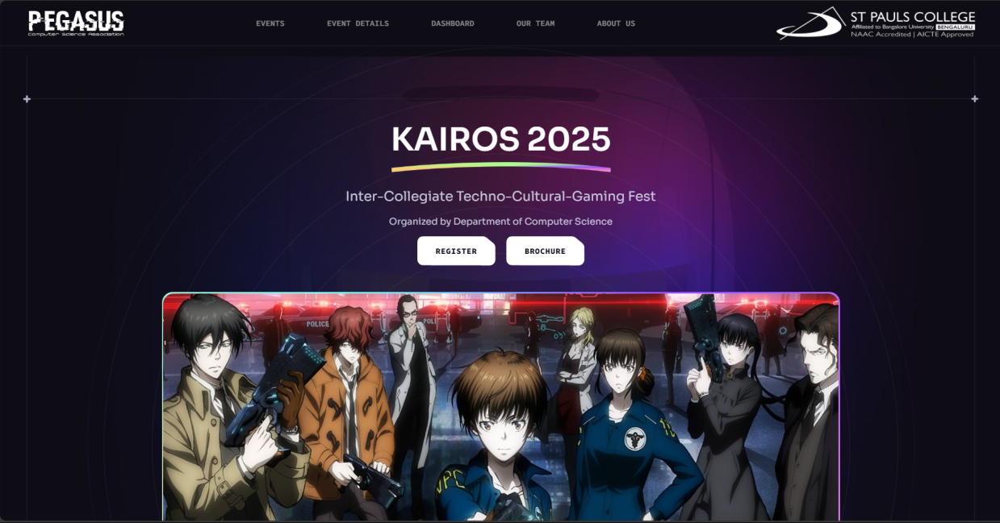
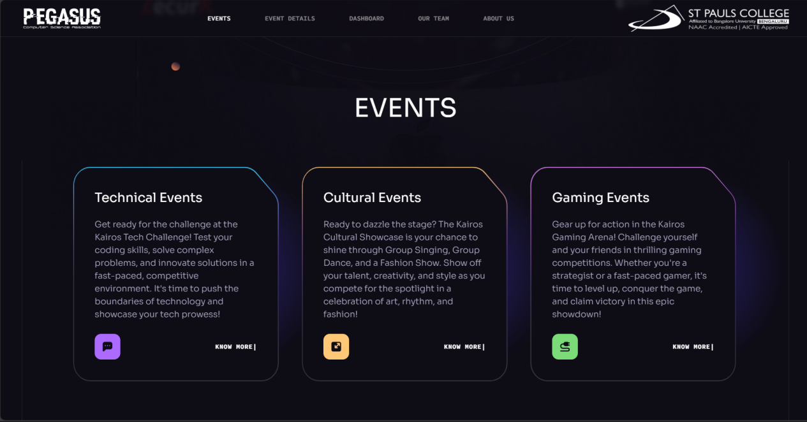
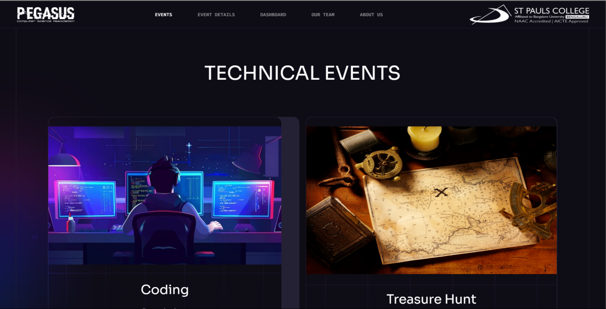
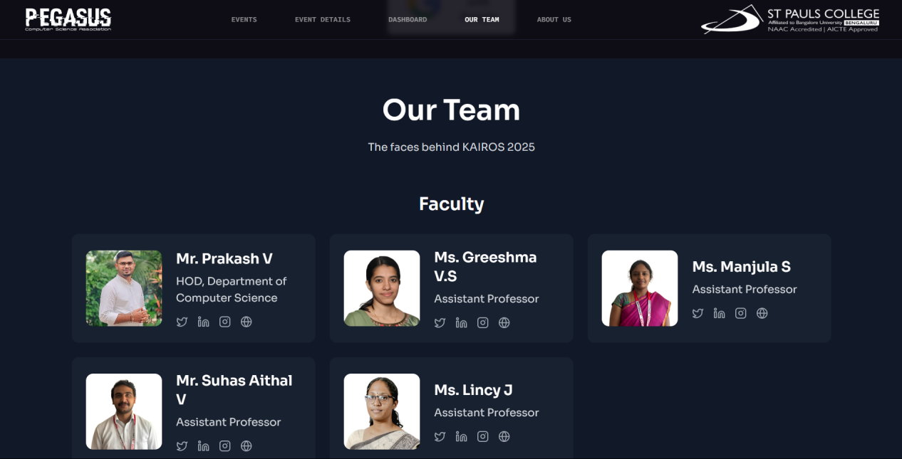
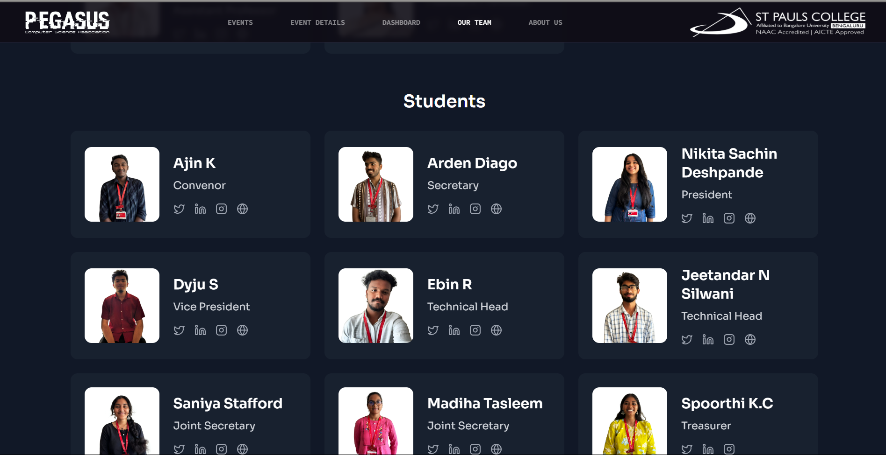

### UserDashboard
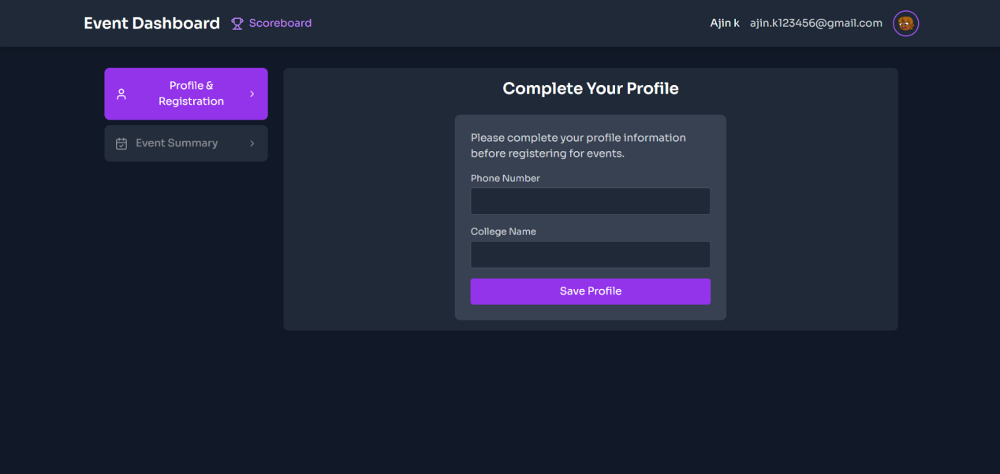
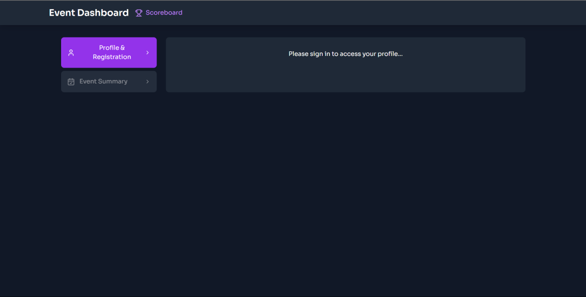
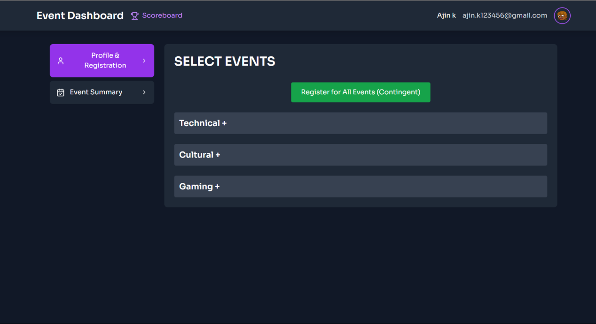
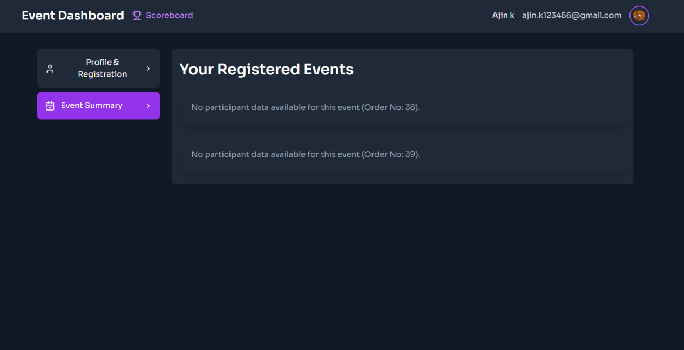
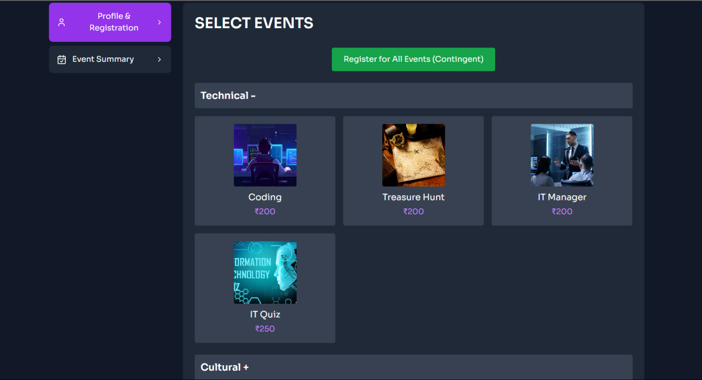
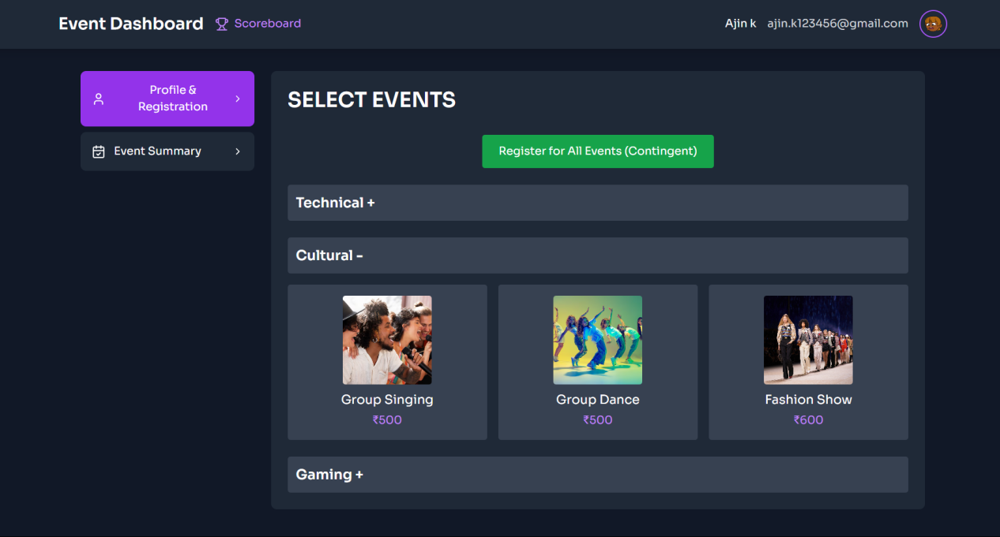
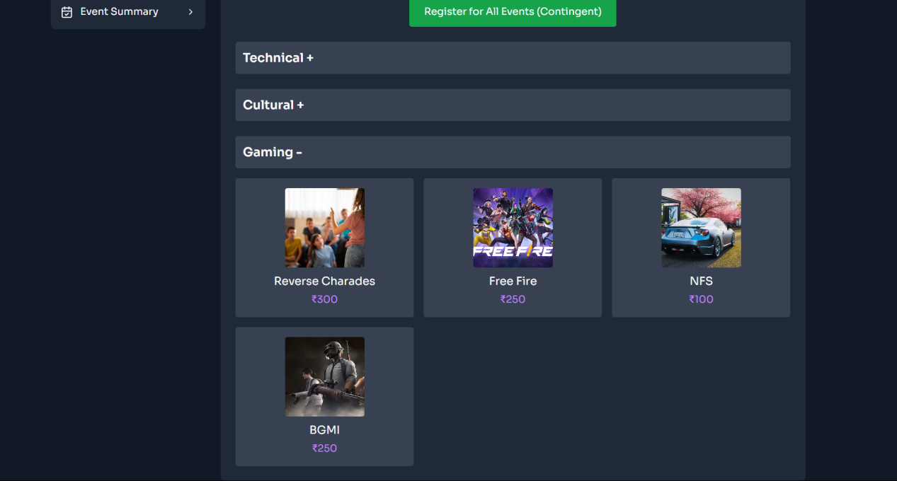

### AuthScreen
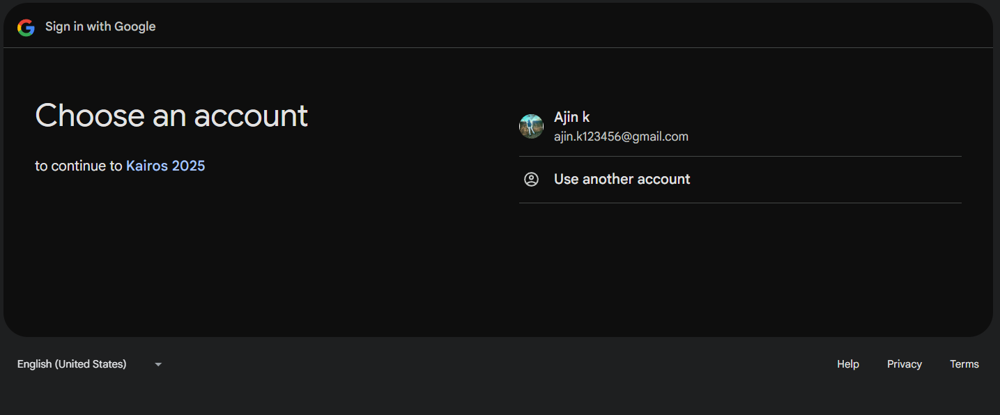

### Payment Page
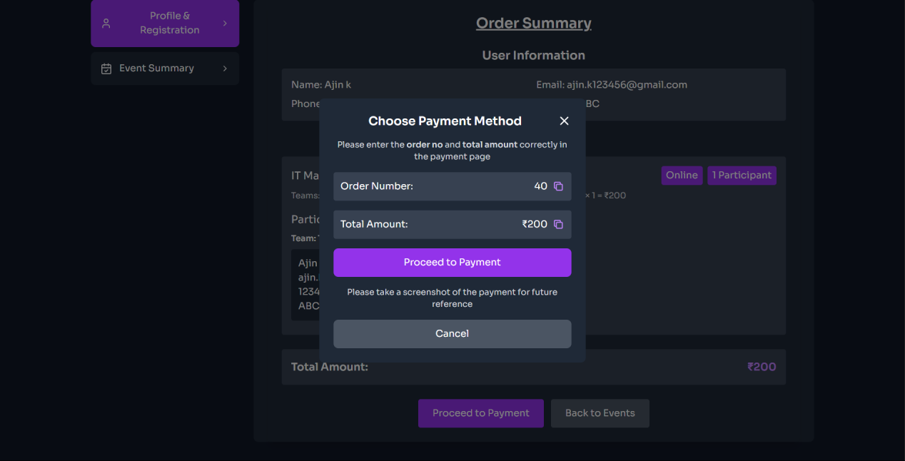

---
---
# App Configuration

These configurations are required for the server to function.

---

### 🔐 Google Cloud Console 
- `CLIENT_ID` = `id`
- `CLIENT_SECRET` = `secret`

---

### 🍪 Cookie Keys (for encrypting session data)
- `COOKIE_KEY_1` = `string`
- `COOKIE_KEY_2` = `string`

---

### 🗄️ Databases
- `MongoDB_URI` = `Production URL`
- `MongoDB_URI_Dev` = `Dev URL`

---

### 💰 Razorpay Keys (for Payment)
- `Razorpay_secret` = `secret`
- `Razorpay_key` = `key`
- `Razorpay_key_Dev` = `key`
- `Razorpay_secret_Dev` = `secret`

---
---

<!-- PROJECT EXECUTION AND SNAPSHOTS  -->
## PROJECT EXECUTION AND SNAPSHOTS

### 🔧 Installation of Applications

- Node.js  
- Git  
- MongoDB  
- Docker  
- Kubernetes  

---

### 🔁 Execution Flow

---

#### 1. System Requirements

To run the project, a stable operating system like **Ubuntu 20.04 or later** is preferred for better compatibility with Docker and Kubernetes. You'll also need:

- Node.js  
- MongoDB  
- Nginx  
- Git for version control  
- Docker for containerization  

A cloud provider like **AWS** is recommended for production deployment. Secure keys and environment variables should be managed properly using `.env` files or secret managers.

---

#### 2. Codebase Setup

- Clone the GitHub repository using Git  
- Install dependencies using `npm` or `yarn`  
- Organize frontend and backend into **separate folders**  
- Maintain clear folder structure for easy development/debugging  
- Update configuration files: `Dockerfile`, `docker-compose.yml`, Kubernetes YAMLs  
- Maintain **environment-specific** configs (`dev` vs `prod`)  

---

#### 3. Database Configuration

- MongoDB is used with **one write DB and three read replicas**  
- A **replica set** ensures automatic failover  
- Separate instances for **development and production**  
- Use **Mongoose** for managing MongoDB in the backend  
- Use **environment variables** for credentials and secure connection strings  

---

#### 4. Docker and Containerization

- Frontend and backend are **containerized**  
- Create Dockerfiles for each component  
- Push images to **Docker Hub**  
- Use **Docker Compose** for local development  
- Use **Kubernetes** for production management  

---

#### 5. CI/CD Pipeline

- **GitHub Actions** automates build, test, and deployment  
- On each push to `main`, code is tested and built into Docker images  
- Images are pushed to Docker Hub  
- Server is updated using **SSH** or **webhooks**  
- If any step fails, deployment is halted  
- Ensures **reliable and error-free** deployment  

---

#### 6. Deployment on AWS

- Deployed using **EC2, EIP, VPC**  
- **Kubernetes** handles orchestration  
- Auto-scaling is enabled for handling traffic spikes  
- Ingress controller routes traffic based on the URL  
- **CloudWatch** is used for monitoring performance and errors  

---

## 💻 Installation Guide for Local Development

To begin working on this project locally, follow these steps:

---

### Required Software Tools

- **Node.js** – JavaScript runtime for backend  
- **MongoDB** – NoSQL database  
- **Postman** – API testing  
- **Git** – Version control  

---

### Step-by-Step Installation

#### ✅ Clone the Repository

```bash
git clone https://github.com/ArdenDiago/Kairos_25-_Final-Year-Project
```
Ensure you're inside the correct folder.

#### 📦 Install Project Dependencies

```bash
npm install
```

Fetches and installs required packages automatically.


#### 🧪 Modify and Test Code
To test your changes locally:

``` bash
npm run server
```

This starts the development server to preview your work.

#### 🚀 Steps for Production Deployment

* Push Code to main Branch
Push your latest updates to the main branch (used for production).

* Trigger GitHub Actions Workflow
This initiates the CI/CD pipeline — build, test, Dockerize, and deploy.

* Ensure Live Server Refresh
On successful workflow completion, the live server reflects the new code.


## Kubernetes Deployment Steps
* Store Kubernetes Configs on the AWS server
* Apply Updated Configuration using:

```bash 
kubectl apply -f .
```

---
---
<h2 align="center">👨‍💻 Developers</h2>

<div align="center" style="display: flex; flex-wrap: wrap; justify-content: center; gap: 40px;">

  <!-- Arden -->
  <div style="text-align: center;">
    <span>
      
      <h4 style="font-size: 2em"><b>Arden Diago</b></h4>
    </span>
    <div style="display: flex; justify-content: center; align-items: center; gap: 15px; margin-top: 5px; background-color: gray; padding: 10px; border-radius: 10px;">
      <a href="https://www.instagram.com/arden.diago/" target="_blank">
        
      </a>
      <a href="https://www.linkedin.com/in/yourlinkedin" target="_blank">
        
      </a>
      <a href="https://github.com/ArdenDiago" traget="_blank">
        
      </a>
    </div>
  </div>

  <!-- Jeetandhar -->
  <div style="text-align: center;">
    <span>
      
      <h4 style="font-size: 2em"><b>Jeetandhar</b></h4>
    </span>
   <div style="display: flex; justify-content: center; align-items: center; gap: 15px; margin-top: 5px; background-color: gray; padding: 10px; border-radius: 10px;">
      <a href="https://www.instagram.com/_heisahotmess_01/" target="_blank">
        
      </a>
      <a href="https://www.linkedin.com/in/jeetandar-n-silwani-6b6863213/" target="_blank">
        
      </a>
      <a href="https://github.com/JEETANDAR" traget="_blank">
        
      </a>
    </div>
  </div>

  <!-- Ajin -->
  <div style="text-align: center;">
    <span>
      
      <h4 style="font-size: 2em"><b>Ajin</b></h4>
    </span>
    <div style="display: flex; justify-content: center; align-items: center; gap: 15px; margin-top: 5px; background-color: gray; padding: 10px; border-radius: 10px;">
      <a href="https://www.instagram.com/__.a._.j._.i._.n.__/" target="_blank">
         
      </a>
      <a href="https://www.linkedin.com/in/ajin-k-815102259/" target="_blank">
        
      </a>
      <a href="https://github.com/Ajin-2004" traget="_blank">
        
      </a>
    </div>
  </div>

</div>
<br>

---
---

<h2 align="center">🎓 Project Mentor</h2>

<div style="text-align: center;">
  <span>
    
    <h4 style="font-size: 2em"><b>Mr. Prakash</b></h4>
  </span>
  <div style="display: flex; width: fit; justify-content: center; align-items: center; gap: 15px; margin-top: 5px; background-color: gray; padding: 10px; border-radius: 10px;">
    <a href="https://www.linkedin.com/in/prakash88/" target="_blank">
      
    </a>
    
  </div>
</div>


